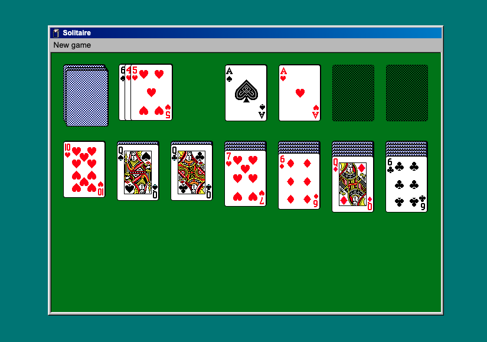

# Solitaire with TypeScript

The original version is from [rjantic](https://github.com/rjanjic/js-solitaire).
I just adapted to use more modern code and TS, but all the codos should go to rjantic.
I learnt a lot through all the code!

<!-- Deploy [here](https://hangman-ts-gamma.vercel.app/) -->

Deploy to be announced

## Tutorial & Motivation

I had already seen the [repo of rjanjic](https://github.com/rjanjic/js-solitaire) for a long time and wanted to find the time to go through his code to understand the whole logic he created. At the end of the day, Solitaire is one of the most searched games on the net and wanted to understand how it works.
